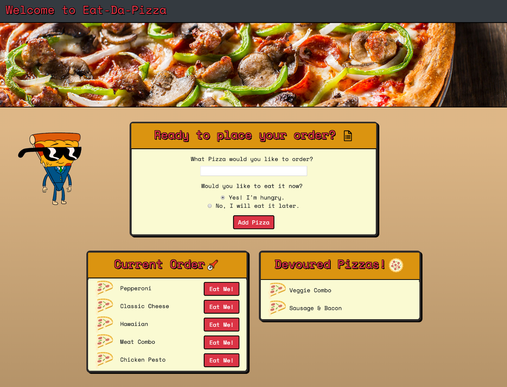

# Eat-Da-Pizza :pizza:

## Welcome to Eat-Da-Pizza!

Eat-Da-Pizza! is a restaurant app that lets users input the names of pizzas they'd like to eat.

When you first visit the webpage, you will see the following screen.

Whenever a user submits an order, the app will display the pizza on the left side of the page under *current order* -- waiting to be devoured.

Each Pizza in the waiting area also has a *Eat Me*! button. When the user clicks it, the Pizza will move to the right side of the page under *Devoured Pizzas!*.

This app will store every pizza in a database, whether devoured or not. 

## Deployed Site
Use this link to see the deployed site: 
https://eatdapizza321.herokuapp.com/

## Built With
- Bootstrap
- Google Fonts
- JavaScript
- Node.js
- MySQL
- NPM packages
   * Express.js
   * Express-handlebars
   * mysql

## Authors
Jennifer Powell 